
<h1 align="center">多用户个人博客网站</h1>

## 简介
多用户个人博客网站：角色分为管理员、用户；支持博客发布、编辑、评论、分类管理、留言反馈、论坛互动、用户收藏、后台管理等功能。    --计算机毕业设计源码；毕设源码；java毕业设计源码

## 联系方式

<h3 align="center">获取完整代码与数据库文件 + 微信：deepguan QQ: 86050149 QQ群: 783742310</h3>

<h3 align="center">可帮忙远程部署 包运行成功！提供远程部署、修改代码、设计文档指导、代码讲解等服务！</h3>

## 功能介绍（完整见运行截图）
管理员：  
基本功能：登录、注册、退出管理后台；查看和管理用户账户。  
博客管理：管理博客分类、内容、图片、发布时间；支持博客的添加、编辑、删除及批量操作；管理用户发布的博客，审核内容确保质量。  
论坛和留言：管理论坛帖子及留言内容，支持按条件查询、回复、删除操作；设置分页和条目数量。  
个人中心：查看和编辑个人信息，修改登录密码。  

用户：  
基本功能：注册新账户、登录系统、退出个人账户。  
博客功能：创建和发布博客，支持分类、标题、内容编辑及图片上传；查看其他用户的博客，进行点赞和评论互动。  
论坛互动：浏览论坛帖子，发表主题帖子，支持公开或私人类型选择；参与帖子评论和回复。  
个人中心：查看和修改个人资料，管理发布的博客和收藏的文章。

## 运行截图
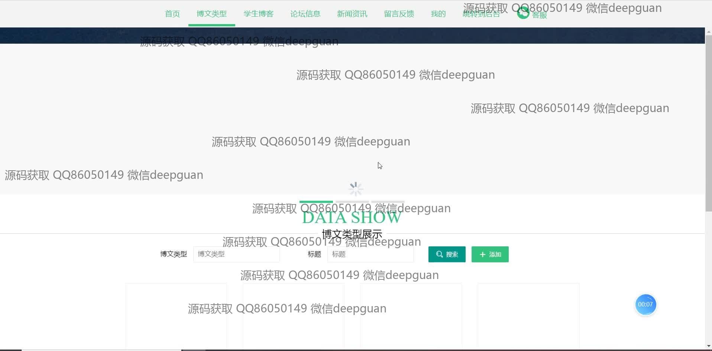
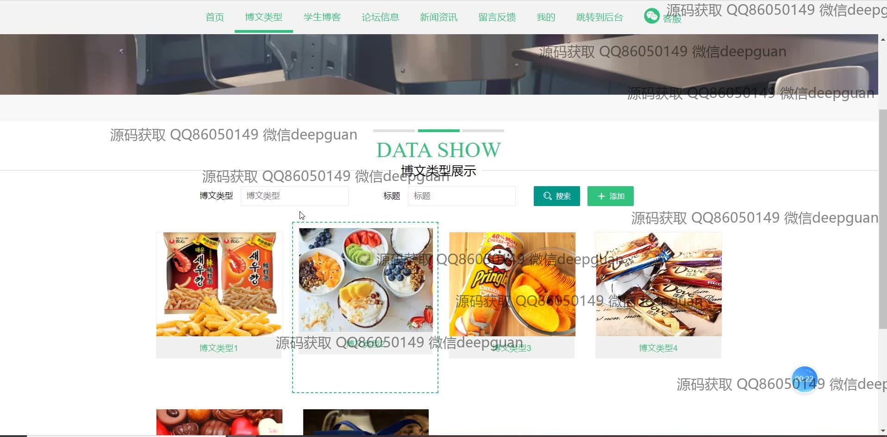
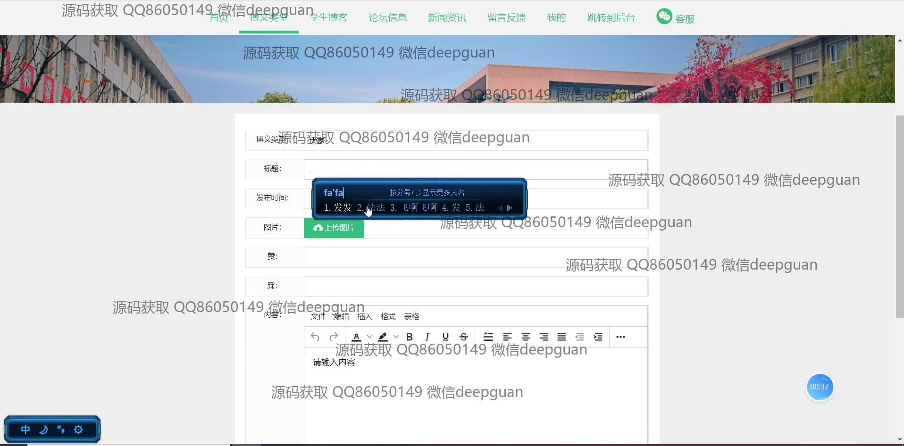
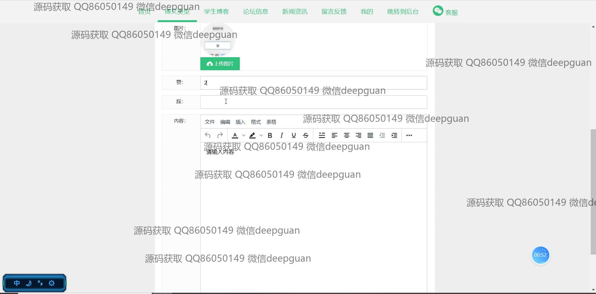
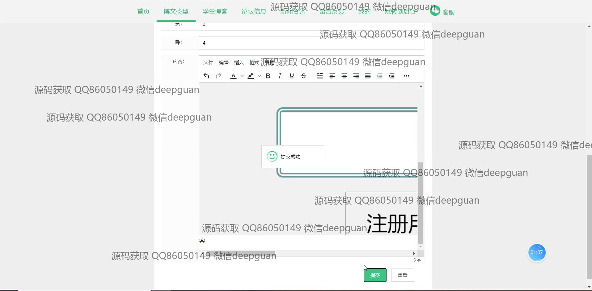
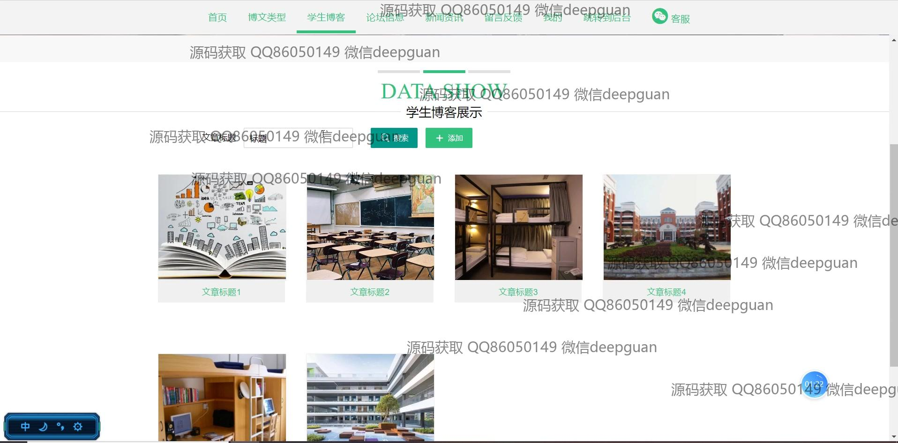
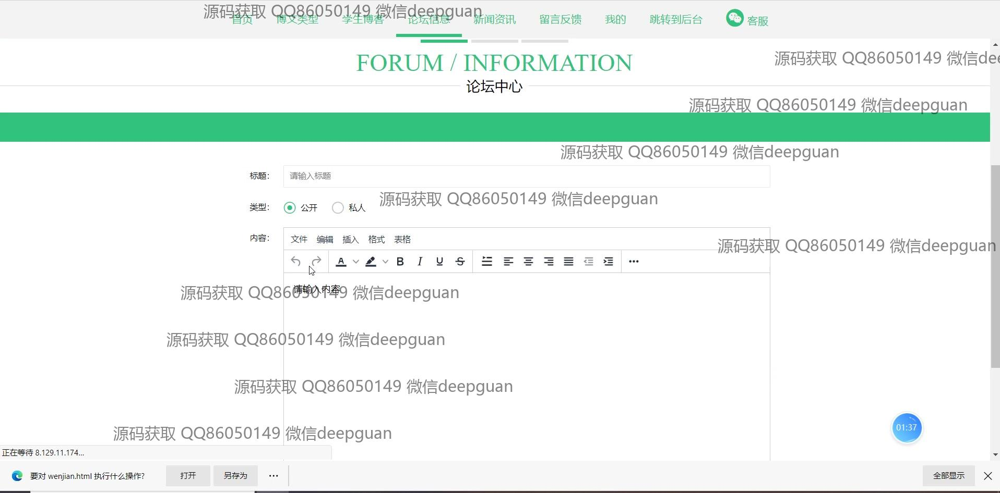
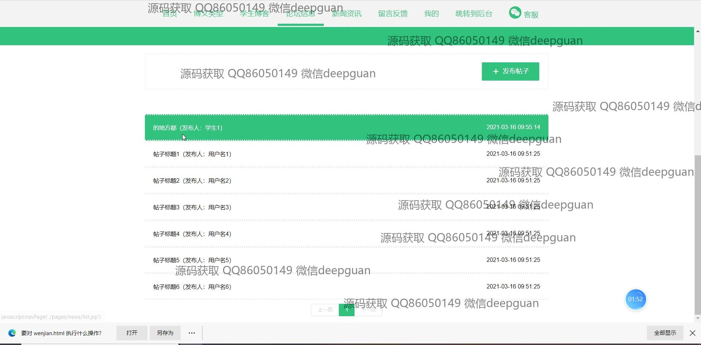
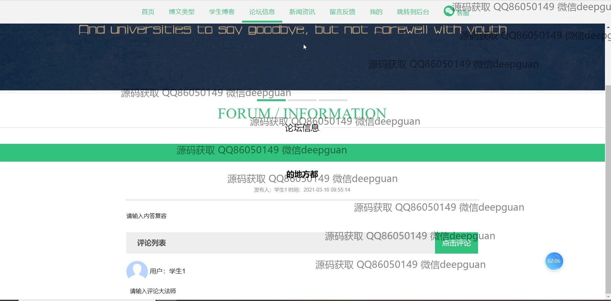
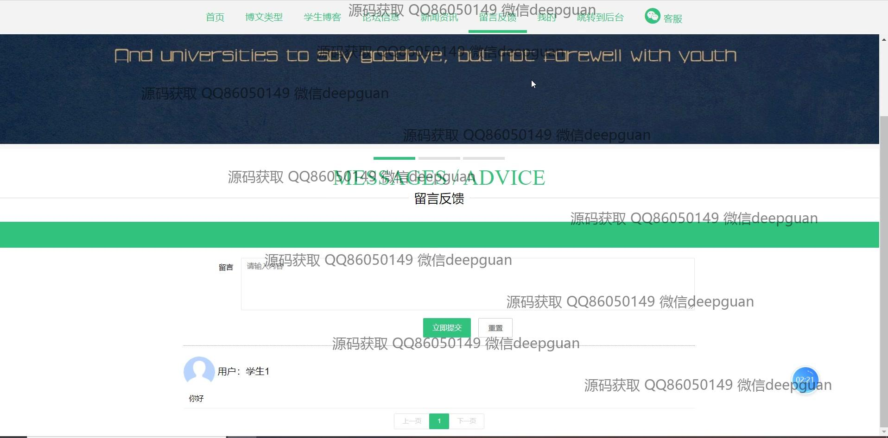
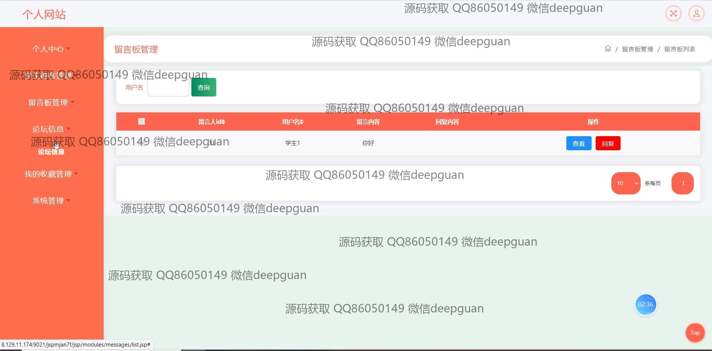
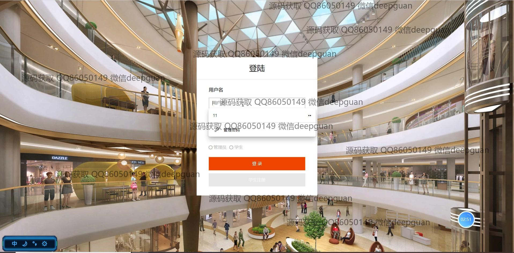
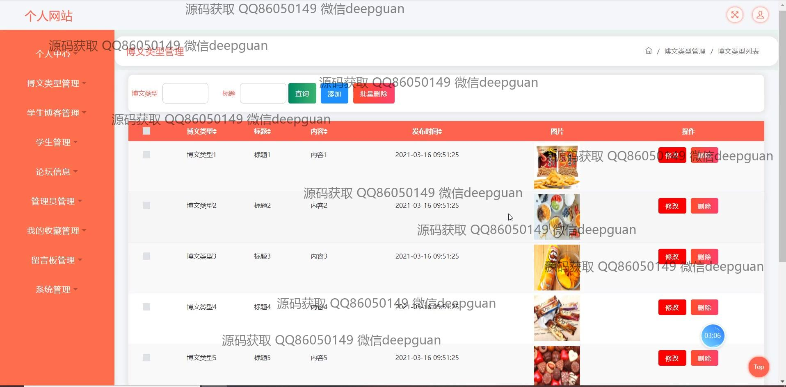
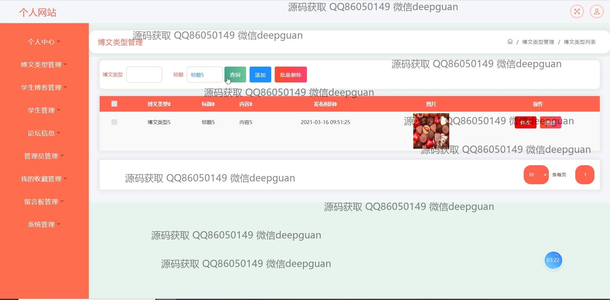
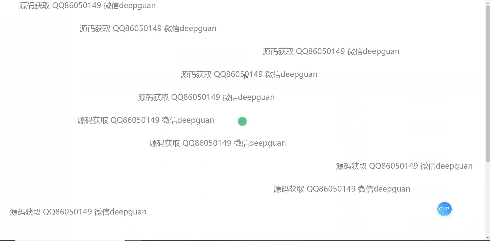
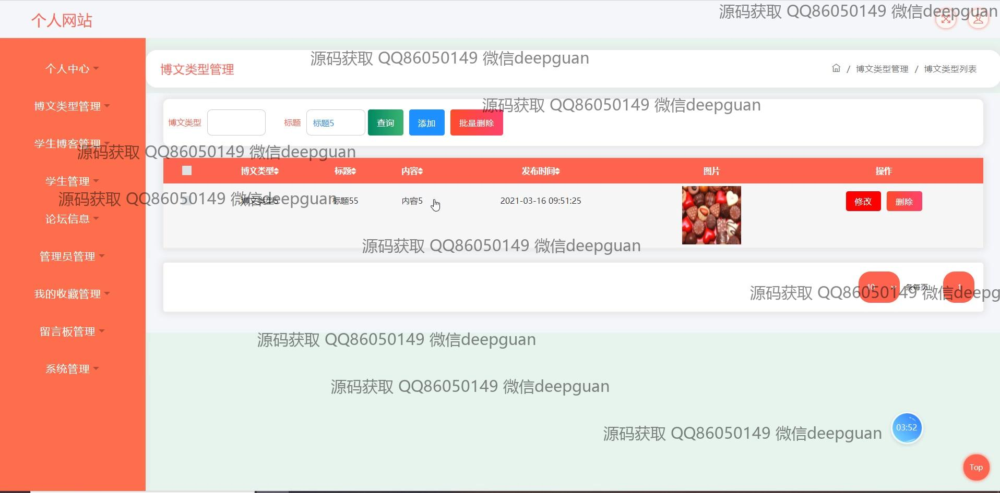
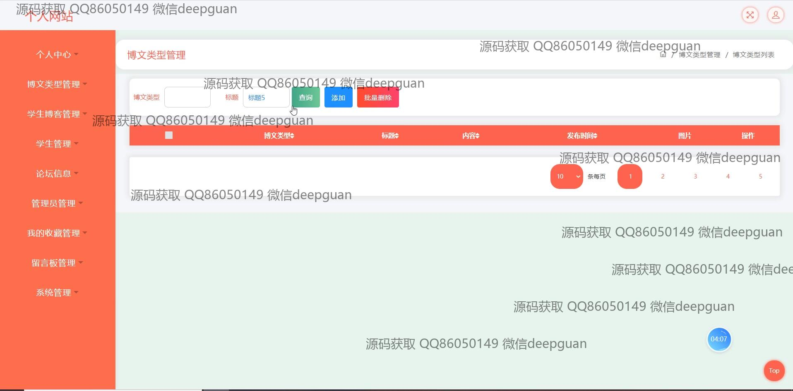
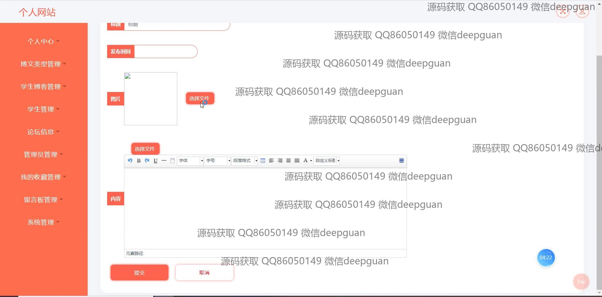
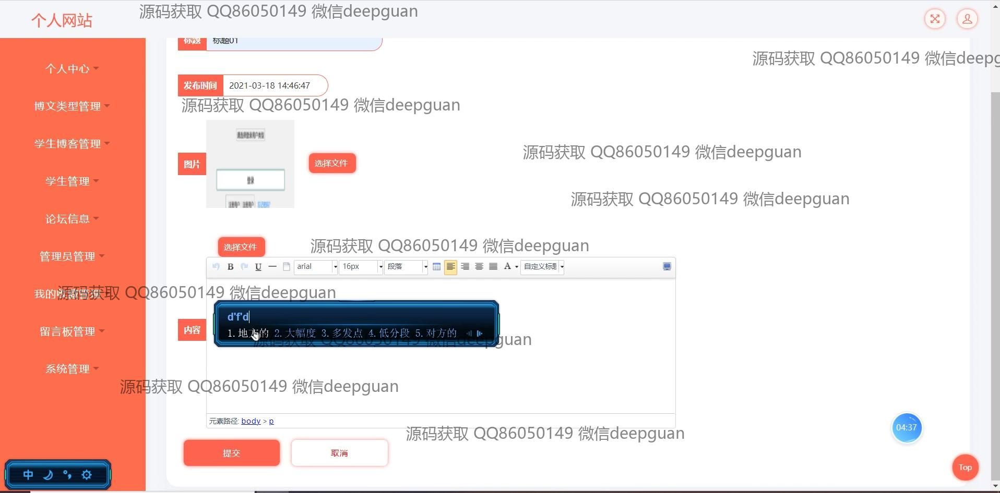
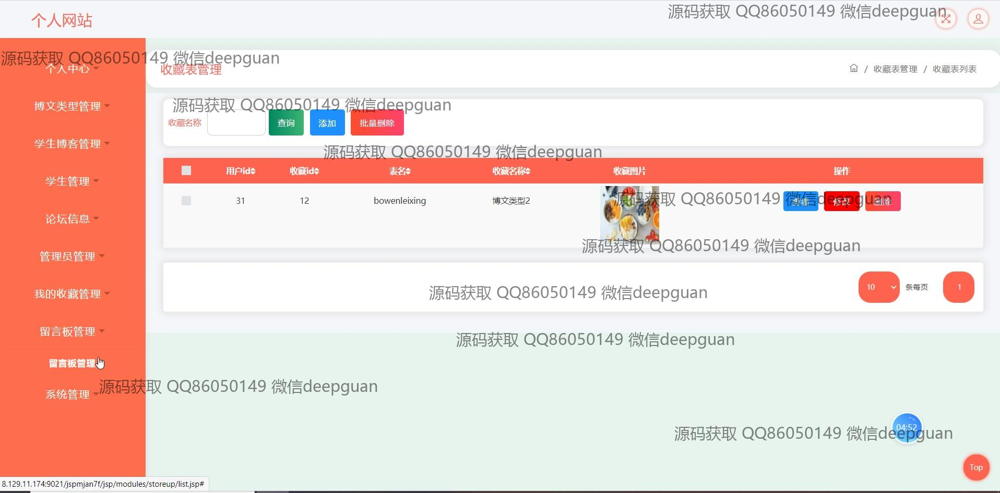
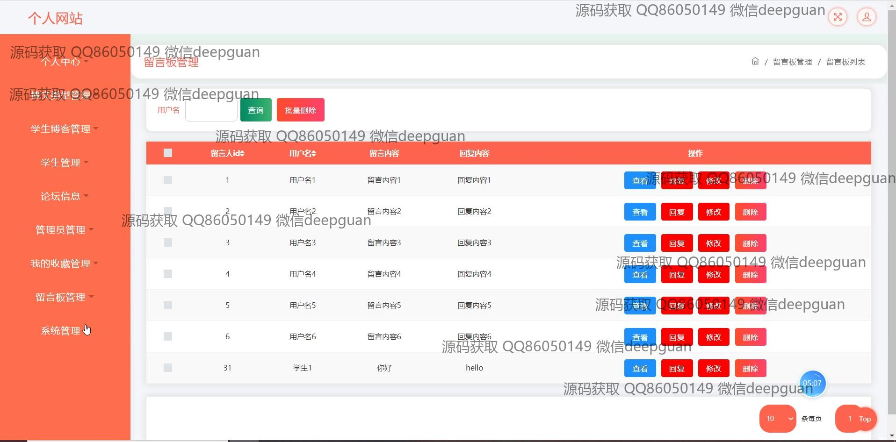

本代码来源于网络,仅供学习参考使用!

